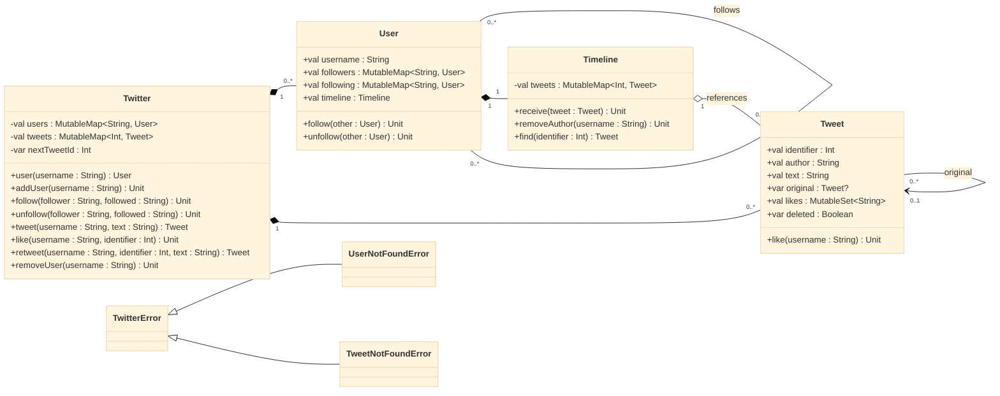

# Twitter — colaboração entre usuários e timelines

<!-- toc-table -->
[Intro](#intro) | [Regras](#regras) | [Diagrama](#diagrama) | [Guide](#guide) | [Verificação](#verificação) | [Shell](#shell)
-- | -- | -- | -- | -- | --
<!-- end -->


## Intro

Esta atividade modela uma rede social pequena: usuários seguem usuários,
publicam tweets, recebem timelines, curtem mensagens e podem retuitar um tweet.
Também há remoção de usuários e dos tweets que eles publicaram.

O objetivo principal é praticar colaboração entre objetos e relações
bidirecionais. Como objetivo secundário, a atividade mostra por que uma
timeline deve ser um componente próprio, com responsabilidade de armazenar e
consultar tweets sem transformar `User` ou `Twitter` em um objeto monolítico.

## Regras

- `Twitter` cadastra usernames uma única vez e cria ids de tweet sequenciais começando em `0`.
- `User.follow(other : User)` registra a relação nos dois usuários; seguir a si mesmo não altera o estado.
- `tweet(username : String, text : String)` publica na timeline do autor e de seus seguidores atuais.
- `like(username : String, identifier : Int)` só funciona para um tweet da timeline do usuário. As curtidas pertencem ao `Tweet` compartilhado e usernames não se repetem.
- `unfollow(follower : String, followed : String)` remove a relação nos dois lados e os tweets daquele autor da timeline do seguidor.
- `retweet(username : String, identifier : Int, text : String)` cria um novo tweet com referência ao original.
- Remover um usuário desfaz seus vínculos e marca seus tweets como removidos. Um tweet removido não aparece sozinho; um retweet continua visível e mantém a referência ao original.
- Usuário inexistente lança `UserNotFoundError` com `fail: usuario nao encontrado`; tweet ausente na timeline lança `TweetNotFoundError` com `fail: tweet nao existe`.
- `Timeline` exibe tweets por id decrescente, com curtidas ordenadas alfabeticamente.
- Os comandos do Shell são `add`, `show`, `follow`, `unfollow`, `twittar`, `timeline`, `like`, `rt`, `rm` e `end`.

## Diagrama


```mermaid
%%{init: {"theme": "base", "themeVariables": {"fontFamily": "monospace"}}}%%
classDiagram
    direction LR

    class Twitter {
        -val users : MutableMap~String, User~
        -val tweets : MutableMap~Int, Tweet~
        -var nextTweetId : Int
        +user(username : String) User
        +addUser(username : String) Unit
        +follow(follower : String, followed : String) Unit
        +unfollow(follower : String, followed : String) Unit
        +tweet(username : String, text : String) Tweet
        +like(username : String, identifier : Int) Unit
        +retweet(username : String, identifier : Int, text : String) Tweet
        +removeUser(username : String) Unit
    }

    class User {
        +val username : String
        +val followers : MutableMap~String, User~
        +val following : MutableMap~String, User~
        +val timeline : Timeline
        +follow(other : User) Unit
        +unfollow(other : User) Unit
    }

    class Timeline {
        -val tweets : MutableMap~Int, Tweet~
        +receive(tweet : Tweet) Unit
        +removeAuthor(username : String) Unit
        +find(identifier : Int) Tweet
    }

    class Tweet {
        +val identifier : Int
        +val author : String
        +val text : String
        +var original : Tweet?
        +val likes : MutableSet~String~
        +var deleted : Boolean
        +like(username : String) Unit
    }

    class TwitterError
    class UserNotFoundError
    class TweetNotFoundError

    TwitterError <|-- UserNotFoundError
    TwitterError <|-- TweetNotFoundError
    Twitter "1" *-- "0..*" User
    Twitter "1" *-- "0..*" Tweet
    User "0..*" -- "0..*" User : follows
    User "1" *-- "1" Timeline
    Timeline "1" o-- "0..*" Tweet : references
    Tweet "0..*" --> "0..1" Tweet : original
```

## Guide

1. Modele `Tweet` como objeto compartilhado. Curtidas precisam alterar o tweet
   visto por todas as timelines, não cópias desconectadas.
2. Crie `Timeline` para encapsular a coleção de tweets e as operações de
   receber, procurar e remover por autor. Isso dá coesão à leitura e à limpeza.
3. Faça `User` manter relações de seguidores e seguidos em ambas as direções.
   Toda alteração deve atualizar os dois lados, preservando a consistência.
4. Faça `Twitter` localizar objetos e coordenar a criação, distribuição,
   retweet e remoção. As regras de armazenamento da timeline permanecem nela.
5. Implemente o `main()` depois do domínio, convertendo texto e apresentando
   exceções nomeadas. Teste relações, compartilhamento de curtidas e falhas.

A atividade trabalha composição e delegação: `Twitter` possui usuários e
tweets; cada usuário possui sua `Timeline`, que
referencia os mesmos tweets do registro central. Usuários e tweets são criados
e removidos pela rede; as timelines pertencem aos usuários. Essa colaboração
mantém curtidas compartilhadas e centraliza as regras de vínculo, ao custo de
coordenar referências bidirecionais e limpar essas relações durante a remoção.

## Verificação

Execute `tko run . -l kt` para verificar publicação para seguidores, unfollow,
curtidas, retweet, remoção e ids inexistentes.

## Shell

```sh
#TEST_CASE basic
$add goku
$add sara
$follow goku sara
$twittar sara hoje estou feliz
$like goku 0
$timeline goku
0:sara (hoje estou feliz) [goku]
$end
```

```sh
#TEST_CASE shared likes and unfollow
$add goku
$add sara
$follow goku sara
$twittar sara hello
$like goku 0
$timeline sara
0:sara (hello) [goku]
$unfollow goku sara
$timeline goku
$end
```

```sh
#TEST_CASE missing references
$add goku
$like goku 0
fail: tweet nao existe
$timeline nobody
fail: usuario nao encontrado
$end
```

```sh
#TEST_CASE retweet remains after original author removal
$add goku
$add sara
$follow goku sara
$twittar sara original
$rt goku 0 quote
$rm sara
$timeline goku
1:goku (quote)
$end
```
