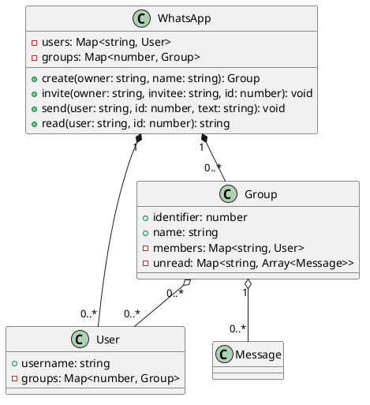

# WhatsApp — grupos e estado de leitura por participante

<toc-table />


## Intro

Usuários podem criar grupos, convidar participantes, enviar mensagens e ler
apenas as mensagens ainda não lidas por eles. A atividade amplia `Mensagem`:
agora a leitura não é propriedade de uma caixa global, mas do par participante
e grupo.

O objetivo principal é modelar composição e estado por participante. O grupo
possui membros e controla a distribuição; o usuário mantém os grupos de que
participa para consultas e notificações.

## Regras

- usernames são únicos e precisam existir para participar de uma operação.
- O criador entra automaticamente no grupo.
- Apenas membro pode enviar, ler ou convidar para o grupo.
- Uma mensagem não é entregue novamente ao próprio remetente.
- Cada membro lê e limpa somente suas próprias mensagens pendentes.
- `notify` informa a quantidade não lida em cada grupo do usuário.

## Diagrama



## Guide

Modele `Group` como dono dos membros e do mapa de mensagens pendentes por
usuário. `WhatsApp` coordena os mapas globais e `User` mantém a relação de
participação. Não use um único contador de leitura para o grupo: isso faria a
leitura de uma pessoa apagar a mensagem para todas as outras.

## Verificação

Execute `python3 -m unittest discover src/py` e teste criação, convite,
mensagem, leitura independente, notificação e acesso de não membros.

## Shell

```sh
#TEST_CASE basic
$add goku
$add sara
$create goku friends
$invite goku sara 0
$zap goku 0 hello
$notify sara
friends(1)
$ler sara 0
goku: hello
$end
```
