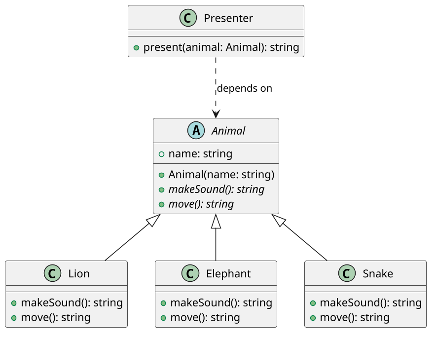

# [ALONE] Zoo: contrato comum e comportamento polimórfico

<!-- toc-table -->
[Intro](#intro) | [Regras](#regras) | [Diagrama](#diagrama) | [Guide](#guide) | [Verificação](#verificação) | [Draft](#draft)
-- | -- | -- | -- | -- | --
<!-- toc-table -->

## Intro

Um zoológico precisa apresentar animais diferentes. Todos possuem um nome,
mas cada espécie produz um som e se movimenta de uma maneira própria.

O objetivo principal é usar um contrato comum para tratar objetos diferentes
sem testar sua classe concreta. A função `present` recebe um `Animal`, mas o
comportamento executado depende do objeto real recebido.

## Regras

- `Animal` é uma classe abstrata com o atributo `name`.
- Toda subclasse deve implementar `make_sound()` e `move()`.
- `Lion`, `Elephant` e `Snake` são animais concretos.
- `present(animal: Animal)` deve usar somente o contrato de `Animal`.
- `present` não pode verificar tipos concretos com `isinstance` nem consultar o
  nome da classe para decidir o comportamento.
- Os métodos retornam textos; nenhuma classe imprime diretamente.
- O programa deve construir uma lista de `Animal` contendo objetos de espécies
  diferentes e apresentar todos pela mesma função.

## Diagrama



## Guide

1. Crie `Animal` como uma classe abstrata com `name` e os métodos abstratos
   `make_sound` e `move`.
2. Crie as três subclasses e implemente os dois comportamentos de cada uma.
3. Implemente `present` recebendo `Animal`. Não acrescente condicionais para
   distinguir as espécies.
4. Monte uma `list[Animal]` com as três espécies e chame `present` para cada
   elemento.
5. Compare a função antes e depois de adicionar uma nova espécie. Se nenhuma
   alteração for necessária em `present`, o contrato está cumprindo seu papel.

A herança é usada aqui porque cada espécie é um `Animal` e precisa cumprir o
mesmo contrato. A classe abstrata evita animais incompletos, enquanto o
despacho polimórfico permite que a coordenação permaneça simples. Não há
necessidade de criar classes para jaulas, cuidadores ou alimentação nesta
primeira atividade de polimorfismo.

Perguntas de reflexão:

- Por que `present` não precisa saber se recebeu um leão ou uma cobra?
- O que mudaria se `present` usasse `isinstance` para escolher o som?
- Por que `Animal` é uma abstração útil mesmo não sendo instanciada diretamente?
- Que nova espécie poderia ser adicionada sem modificar `present`?

## Verificação

Execute os testes da implementação canônica:

```bash
python3 -m unittest discover -s src/py -p 'test_*.py'
```

O resultado esperado é:

```text
Simba: roar, run
Babar: trumpet, walk
Kaa: hiss, slither
```

## Draft

<!-- links .cache/starter -->
<!-- links -->
