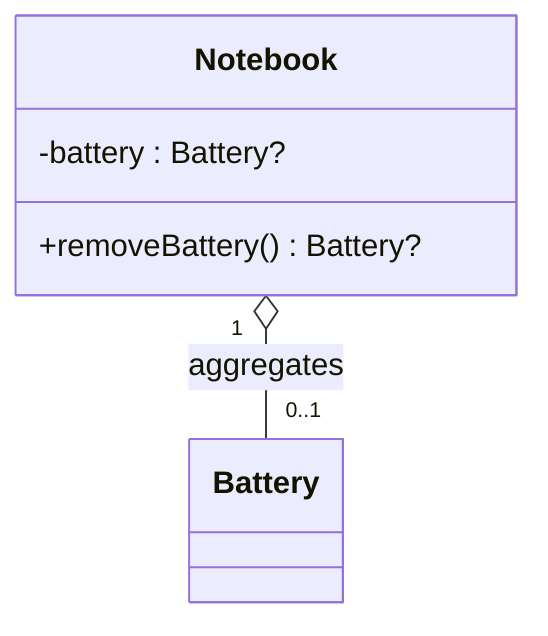

# [INTRO] Padrão para atividades de código

<!-- toc-table -->
<!-- toc-table -->

## Intro

Uma atividade de código deste repositório é um pequeno projeto de programação. O aluno recebe um problema de modelagem, implementa as classes principais e valida o comportamento esperado por testes automatizados ou por orientações de implementação.

O formato precisa atender até três públicos ao mesmo tempo:

- O aluno, que precisa entender o domínio, as classes, as regras e o que deve entregar.
- O professor, que precisa de um enunciado estável para orientar implementação e avaliação.
- O `tko`, nas atividades com `Shell`, que usa os comandos e respostas para extrair testes de entrada e saída.

As atividades como `carro`, `calculadora`, `animal`, `motoca`, `grafite`, `lapiseira`, `contato`, `budega` e `tamagotchi` mostram o padrão com Shell. Atividades como `toalha`, `chinela` e `camisa` mostram outro tipo importante: atividades de implementação orientada, sem testes de entrada e saída no README.

## Tipos

Use o tipo de avaliação para escolher o formato da atividade.

- `eval=test`
  - Atividade com Shell e testes parseados pelo `tko`.
  - Deve ter uma seção `Shell` com comandos, respostas, `#TEST_CASE` e `$end`.
  - Deve definir formatos textuais literalmente, porque eles serão comparados nos testes.
  - Exemplos: `carro`, `calculadora`, `animal`, `grafite`, `lapiseira`, `budega`.
- `eval=self`
  - Atividade de implementação orientada, sem contrato de Shell obrigatório.
  - Deve ter requisitos claros, lista de métodos, comportamento esperado e exemplos de uso ou roteiro de verificação.
  - Pode pedir que o aluno crie seus próprios testes, como em `toalha`.
  - Exemplos: `toalha`, `chinela`, `camisa`, algumas leituras práticas ou atividades introdutórias.

Mesmo sem Shell, uma atividade de código precisa definir bem o estado, os métodos, os limites e o critério de conclusão.

## Elementos

Toda nova atividade de código deve usar estas seções base, nesta ordem.

- Título
  - Deve nomear o projeto em linguagem natural.
  - Exemplo: `# Um carro simples`.
- `toc-table`
  - Deve ficar logo abaixo do título.
  - Em atividades com Shell, deve listar: `Intro`, `Regras`, `Diagrama`, `Guide`, `Shell`, `Draft`.
  - Em atividades orientadas, deve listar: `Intro`, `Regras`, `Diagrama`, `Guide`.
- Capa
  - Deve usar `` quando houver imagem.
  - A imagem ajuda a reconhecer a atividade, mas não deve carregar requisito técnico.
- `Intro`
  - Deve apresentar o contexto e o objetivo em poucas linhas.
  - Deve dizer quais classes ou estruturas principais serão implementadas.
  - Deve deixar claro o que pertence ao domínio e o que pertence ao Shell.
- `Regras`
  - Deve ser o contrato do problema.
  - Deve listar propriedades, estado inicial, construtor ou comando de inicialização, formato de exibição, operações, limites e mensagens de falha usando a notação Kotlin.
- `Diagrama`
  - Deve apresentar o modelo de classes e as relações relevantes para a atividade.
  - Deve seguir a convenção definida em [Diagramas](#diagramas).
- `Guide`
  - Deve orientar a implementação em partes.
  - Pode conter diagrama, vídeo, dicas de linguagem e sequência sugerida.
  - Não deve conter solução completa no padrão base.
- `Shell`
  - Obrigatória apenas para atividades `eval=test`.
  - Deve conter os testes no formato de comandos e respostas.
  - Essa seção é contrato executável para o `tko`.
- `Draft`
  - Recomendada para atividades `eval=test` ou quando houver esqueleto inicial.
  - Deve reservar o bloco de links para esqueletos gerados ou mantidos pelo `tko`.

### Regras de escrita

- Escreva primeiro o comportamento observável, depois detalhes de implementação.
- Escreva explicações em português e use Kotlin para identificadores, assinaturas e tipos: `Person`, `fuel(liters : Int) Unit`.
- Defina todo formato textual que será comparado nos testes, incluindo espaços, pontuação, casas decimais e acentos.
- Para cada operação, informe entrada, efeito no estado, saída em caso normal e saída em caso de falha.
- Evite misturar regra de negócio com regra de Shell. A classe de domínio não deve ler entrada nem imprimir saída.
- Prefira comandos curtos, estáveis e sem ambiguidade: `$init`, `$show`, `$enter`, `$leave`, `$charge`, `$drive`.
- Em atividades sem Shell, substitua o contrato de comandos por uma lista de métodos, retornos esperados e exemplos de chamada.

### Separação de responsabilidades

- Classes de domínio guardam estado e regras.
- Classes de domínio retornam valores, objetos, booleanos, enums ou resultados que representem sucesso e falha.
- O Shell lê comandos, converte argumentos, chama métodos e imprime mensagens.
- O Shell pode traduzir falhas para mensagens como `fail: tanque vazio`.
- O Shell não deve conter regra de negócio que deveria estar nas classes do domínio.

## Shell

A seção `Shell` só deve existir quando a atividade tiver testes de comandos. Ela deve ser escrita como uma sequência de simulações. Cada simulação fica em um bloco fenced `bash` ou `sh`.

```bash
#TEST_CASE nome do caso
$comando arg1 arg2
saida esperada
$end
```

Regras para os testes:

- Todo caso deve começar com `#TEST_CASE nome`.
- Todo comando executado pelo aluno deve começar com `$`.
- A saída esperada deve aparecer exatamente como o programa deve imprimir.
- Cada bloco deve terminar com `$end`.
- Comentários explicativos podem aparecer antes dos comandos, mas não devem substituir o contrato formal na seção `Regras`.
- Casos devem evoluir em dificuldade: inicialização, operação básica, limite, erro, estado após erro, reinicialização e caso composto.

Mensagens:

- Use `fail: ...` para falhas que impedem a operação.
- Use `warning: ...` para avisos quando a operação acontece, mas com consequência especial.
- Mantenha mensagens literais e consistentes em todos os lugares: `Regras`, `Guide`, `Shell` e código de apoio.

## Template

Use estes modelos como base:

- [modelo.md](modelo.md) para atividades com Shell e `eval=test`.
- [modelo_orientada.md](modelo_orientada.md) para atividades de implementação orientada e `eval=self`.

Checklist antes de publicar uma atividade:

- O estado inicial está completamente definido.
- Toda operação ou método pedido aparece em `Regras`.
- Todo formato de saída ou representação textual está definido literalmente.
- Atividades com Shell têm todos os comandos e mensagens de erro documentados em `Regras`.
- Atividades com Shell cobrem sucesso, erro e estado depois do erro.
- Atividades sem Shell têm exemplos de uso ou um roteiro mínimo de verificação.
- A regra de separação entre domínio e interação está explícita quando houver interface de entrada e saída.
- O diagrama de classes usa a notação Kotlin descrita em [Diagramas](#diagramas), inclusive para propriedades, parâmetros, retornos e nulabilidade.
- O diagrama Mermaid está escrito diretamente no README; não há imagem nem arquivo PlantUML separado.
- O `Draft` existe com os marcadores de links quando houver esqueleto.
- `tko tool mdpp README.md` roda sem quebrar o Markdown.

## Diagramas

Os diagramas de classes devem usar tipos e nomes Kotlin para que a documentação e as soluções de referência compartilhem um só modelo.

- Use `Int`, `Double`, `String`, `Boolean` e `Unit` para tipos comuns.
- Use `Tipo?` quando uma propriedade ou retorno puder representar ausência de valor.
- Use `List<Tipo>` ou `MutableList<Tipo>` para coleções ordenadas, conforme possam ser alteradas pelo objeto.
- Use `Map<K, V>` para estruturas chave-valor.
- Escreva propriedades e parâmetros como `name : String`, com espaços antes e depois de `:`.
- Escreva métodos sem dois-pontos entre a assinatura e o tipo de retorno, por exemplo `+drive(minutes : Int) DriveResult`.
- Use a multiplicidade UML nas associações, por exemplo `0..1` para uma referência opcional e `0..*` para uma coleção.
- Marque membros estáticos com `$` no fim da linha, por exemplo `+DEAD_STAGE : Int$`.
- Não use tuplas como padrão. Quando os valores tiverem significado próprio, modele atributos nomeados.
- Preserve os modificadores UML (`+`, `-`, `#`) para indicar a visibilidade.
- Escreva o diagrama como um bloco Mermaid `classDiagram` no README, com fonte monoespaçada e direção explícita. Use `~` para delimitar tipos genéricos no Mermaid, como `MutableList~Player~`.

Exemplo:


