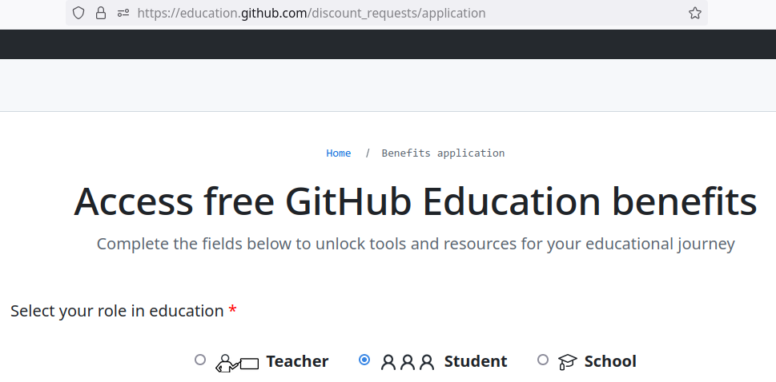
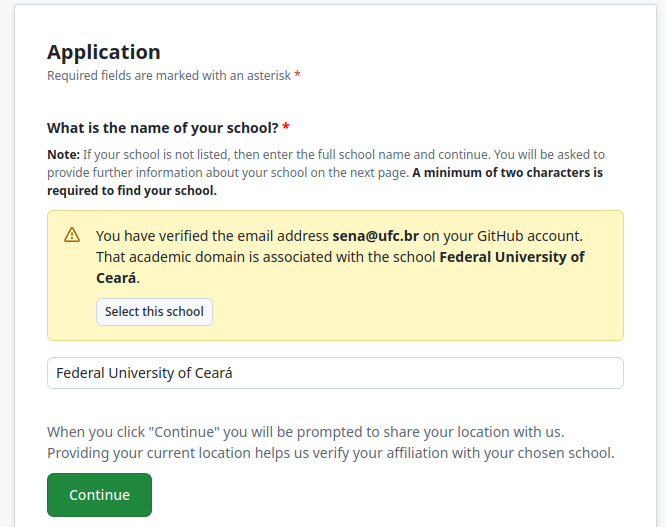

# Habilitando a conta Educational no Github

- Acesse o [LINK](https://education.github.com/discount_requests/application).
- Escolha a opção de Estudante



- Cadastre o email @alu.ufc.br e escolha a Universidade Federal do Ceará



- Na tela seguinte, envie um **FOTO** ou **PRINT** de um documento com **DATA** que comprove seu vínculo com a universidade. Pode ser o comprovante de matrícula. Para tirar o **PRINT**, gere o pdf e converta a página com os dados para png. No linux, o comando para conversão é

```bash
magick  -density 300 input.pdf -quality 100 output.png
```

- Após fazer upload, ele vai mostrar se o documento foi rejeitado por não ter a resolução mínima, ou foi aceito. No print abaixo, o documento foi aceito dentro da resolução mínima.


- A resposta da solicitação não é imediata. A solicitação leva alguns dias para ser processada. No próprio [LINK](https://education.github.com/discount_requests/application) de aplicação, será mostrado o status da sua solicitação e se ele for expirado. Se você ainda for aluno quando o link expirar, basta refazer a socitação reenviando um documento comprobatório.


